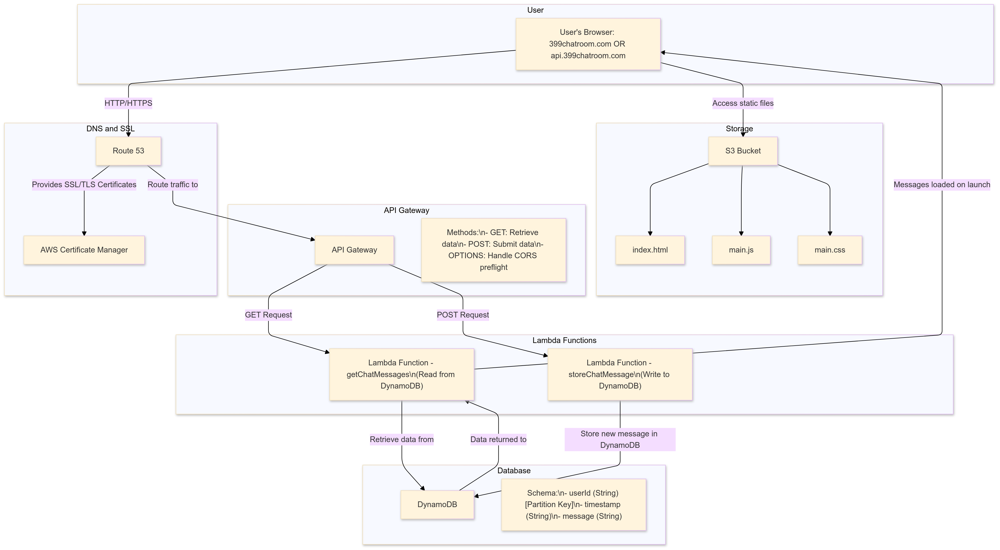

# Overview



# AWS Chat Application

## Overview
This project sets up a serverless chat application on AWS, including S3 for static file hosting, DynamoDB for storing messages, Lambda for backend logic, and API Gateway for the API endpoint.

## Project Structure
- `infrastructure/`: Contains configuration files and deployment scripts.
- `lambdas/`: Contains Lambda function source code.
- `static/`: Contains static files for the web interface (HTML, CSS, JS).

## Setup Instructions

### Prerequisites
- AWS CLI configured on your machine.
- Node.js and npm (for Lambda function dependencies).

### Step 1: Deploy Infrastructure
Run the following command to create and deploy all resources:

```bash
cd infrastructure/scripts
./up.sh
